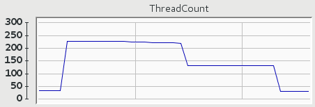
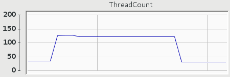

Let me start this post with a question.
Imagine a service returning a value whose fetching from some other service (e.g. database) takes 1 second:

```java
@SpringBootApplication
@RestController
public class WebApplication {

    public static void main(String[] args) {
        SpringApplication.run(WebApplication.class, args);
    }

    @GetMapping("/value")
    String fetchValue() throws InterruptedException {
        TimeUnit.SECONDS.sleep(1);
        return "42";
    }
}
```

How many transactions per second can we get when we hit it with 10 concurrent users?

I know you already have an answer but let's be a good engineer and measure instead of guessing.
Let's run [siege](https://github.com/JoeDog/siege) in benchmark mode with 10 concurrent users, each issuing 10 subsequent requests:

```sh
$ siege -b -c 10 -r 10 http://localhost:8080/value
Transactions:                100 hits
Availability:             100.00 %
Elapsed time:              10.05 secs
Data transferred:           0.00 MB
Response time:              1.00 secs
Transaction rate:           9.95 trans/sec
Throughput:                 0.00 MB/sec
Concurrency:                9.99
Successful transactions:     100
Failed transactions:           0
Longest transaction:        1.01
Shortest transaction:       1.00
```

We're getting 9.95 transactions per second (transaction rate), which is close to the theoretical maximum of 10 TPS.

That was easy.
Let's make it a bit more interesting: how many TPS can we get if we increase the number of concurrent users to 100?

```sh
$ siege -b -c 100 -r 10 http://localhost:8080/value
Transactions:               1000 hits
Availability:             100.00 %
Elapsed time:              50.20 secs
Data transferred:           0.00 MB
Response time:              4.82 secs
Transaction rate:          19.92 trans/sec
Throughput:                 0.00 MB/sec
Concurrency:               95.97
Successful transactions:    1000
Failed transactions:           0
Longest transaction:        5.05
Shortest transaction:       1.01
```

WAT?
It's not even near to 100 TPS.
How is that even possible?
Well let me tell you a secret, I have set max number of Tomcat worker threads to 20.

```java
server.tomcat.max-threads=20
```

So now that we know what is the limiting factor let's get rid of this custom worker thread limit and repeat the test with the default configuration (200 worker threads in case of Tomcat 8.5):

```sh
$ siege -b -c 100 -r 10 http://localhost:8080/value
Transactions:               1000 hits
Availability:             100.00 %
Elapsed time:              10.06 secs
Data transferred:           0.00 MB
Response time:              1.00 secs
Transaction rate:          99.40 trans/sec
Throughput:                 0.00 MB/sec
Concurrency:               99.73
Successful transactions:    1000
Failed transactions:           0
Longest transaction:        1.02
Shortest transaction:       1.00
```
The actual numbers are not that interesting (yes, we went close to 100 TPS) as threads usage:


We start with less than 50 live threads and when 100 users hit the service we quickly reach almost 150 live threads and keep them alive for some time after the traffic is gone just in case they could be reused.
It's worth pointing out that we are limited by the number of worker threads and once we exceed that number of concurrent requests we will start queuing.

Now let's sprinkle our service with some reactive magic by replacing old handler method with a reactive one:

```java
@GetMapping("/value")
Mono<String> fetchValue() {
    return Mono.fromCallable(() -> {
        sleepFor(1, SECONDS);
        return "42";
    });
}
```

as well as replacing spring-boot-starter-web dependency by spring-boot-starter-webflux[^1].

```xml
<dependency>
    <groupId>org.springframework.boot</groupId>
    <artifactId>spring-boot-starter-webflux</artifactId>
</dependency>
```

With all this reactive bits and pieces in place let's see what happens if we hit our service with 100 concurrent users:

```sh
$ siege -b -c 100 -r 10 http://localhost:8080/value
Transactions:               1000 hits
Availability:             100.00 %
Elapsed time:             126.51 secs
Data transferred:           0.00 MB
Response time:             12.01 secs
Transaction rate:           7.90 trans/sec
Throughput:                 0.00 MB/sec
Concurrency:               94.91
Successful transactions:    1000
Failed transactions:           0
Longest transaction:       13.09
Shortest transaction:       1.00
```

WAT?
A mere 8 TPS.
There has to be another thread limit in place!
In fact there is one: there will be as many event loop threads as __Runtime.getRuntime().availableProcessors()__ (as we can see from the results we have 8 available processors).

Yes, you heard it right - event loops.
By default Spring Boot 2 will switch from Tomcat to Netty if you use spring-boot-starter-webflux.
Later on we'll see how our reactive implementation performs on Tomcat but for now let's stick to Netty, a damn fast asynchronous event-driven network application framework.
Let's take another look at our implementation and see if we have missed something because those 8 TPS stay in opposition to Netty being fast.

```java
@GetMapping("/value")
Mono<String> fetchValue() {
    return Mono.fromCallable(() -> {
        sleepFor(1, SECONDS);
        return "42";
    });
}
```

Knowing that we have 8 event loop threads we can tell why we are getting just 8 TPS: it's because those threads quickly get blocked by the blocking operations.
It's irresponsible to run any kind of I/O or any other blocking operation on an event loop thread.
The fix is rather obvious - move blocking operation into another thread:

```java
@GetMapping("/value")
Mono<String> fetchValue() {
    return Mono.fromCallable(() -> {
        sleepFor(1, SECONDS);
        return "42";
    }).subscribeOn(Schedulers.elastic());
}
```

```sh
$ siege -b -c 100 -r 10 http://localhost:8080/value
Transactions:               1000 hits
Availability:             100.00 %
Elapsed time:              10.06 secs
Data transferred:           0.00 MB
Response time:              1.00 secs
Transaction rate:          99.40 trans/sec
Throughput:                 0.00 MB/sec
Concurrency:               99.89
Successful transactions:    1000
Failed transactions:           0
Longest transaction:        1.02
Shortest transaction:       1.00
```

Now we are getting similar results as we had on non-reactive implementation running on Tomcat with default 200 worker threads.
Even threads usage looks similar:


The only thing we got rid of is the the worker thread limit that got replaced with unbounded Schedulers.elastic() thread pool.
Of course we can (and often should) replace Schedulers.elastic() with a scheduler over which we have full control (e.g. [by creating one based on an ExecutorService](https://projectreactor.io/docs/core/release/api/reactor/core/scheduler/Schedulers.html#fromExecutorService-java.util.concurrent.ExecutorService-)).

Going reactive on Netty didn't yield noticeable improvements, so let's see how the situation looks like when we replace Netty with Tomcat by adding an explicit dependency on spring-boot-starter-tomcat:

```xml
<dependency>
    <groupId>org.springframework.boot</groupId>
    <artifactId>spring-boot-starter-tomcat</artifactId>
</dependency>
```

```sh
$ siege -b -c 100 -r 10 http://localhost:8080/value
Transactions:               1000 hits
Availability:             100.00 %
Elapsed time:              10.07 secs
Data transferred:           0.00 MB
Response time:              1.01 secs
Transaction rate:          99.30 trans/sec
Throughput:                 0.00 MB/sec
Concurrency:               99.86
Successful transactions:    1000
Failed transactions:           0
Longest transaction:        1.03
Shortest transaction:       1.00
```

The TPS rates are not surprising but threads usage is:



We are using much more threads than we used to (since threads are being kept alive for same time in case they could be reused the actual number of threads used will vary depending on availability of idle threads in the pool).
Let's take another look at the implementation and try to find the reason of such behavior:

```java
@GetMapping("/value")
Mono<String> fetchValue() {
    return Mono.fromCallable(() -> {
        sleepFor(1, SECONDS);
        return "42";
    }).subscribeOn(Schedulers.elastic());
}
```

By now it should be obvious that due to the thread per request model we can end up using 2 threads to process each request: one container worker thread handling the request and an additional thread performing the blocking operation.
To reduce the number of threads used when running on servlet container (i.e. Tomcat) we can simply move back blocking operation to the worker thread (we could also use servlet asynchronous processing facilities in order not to block the worker thread).

```java
@GetMapping("/value")
Mono<String> fetchValue() {
    return Mono.fromCallable(() -> {
        sleepFor(1, SECONDS);
        return "42";
    });
}
```



Of course if you follow what's going on in the Spring ecosystem you know that along with WebFlux Spring Framework 5.0 will allow you to replace MVC-style handler method mappings by functional-style RouterFunctions:

```java
@Bean
RouterFunction<ServerResponse> routerFunction() {
    return route(GET("/value"), request -> fetchValueHandler());
}

Mono<ServerResponse> fetchValueHandler() {
    return ServerResponse.ok()
            .body(fetchValue(), String.class);
}

Mono<String> fetchValue() {
    return Mono.fromCallable(() -> {
        sleepFor(1, SECONDS);
        return "42";
    });
}
```

However it's just a different way of defining request handlers and it doesn't make your application run faster nor use less threads.

As we have seen simply going reactive does not imply making your services faster or use less resources, so why there is so much buzz around it?
Well if you compare how much simpler and safer it is to control where and how your logic is being executed with reactive APIs:

```java
@GetMapping("/value")
Mono<String> fetchValue() {
    return Mono.fromCallable(() -> {
        sleepFor(1, SECONDS);
        return "42";
    }).subscribeOn(Schedulers.elastic());
}
```

than without them:

```java
private static final ExecutorService threadPool = Executors.newCachedThreadPool();

@GetMapping("/value")
DeferredResult<String> fetchValue() {
    DeferredResult<String> deferredResult = new DeferredResult<>();
    fetchValueAsync(deferredResult);
    return deferredResult;
}

private void fetchValueAsync(DeferredResult<String> deferredResult) {
    CompletableFuture.supplyAsync(this::fetchValueSync, threadPool)
            .whenCompleteAsync((result, throwable) -> deferredResult.setResult(result));
}

private String fetchValueSync() {
    Sleeper.sleepFor(1, SECONDS);
    return "42";
}
```

it starts to make sense and making it easier to control this aspect of execution is just one of the perks of reactive implementations.

[^1]: at the time of writing WebFlux (which is part of Spring Framwork 5.0) is in RC1 and Spring Boot 2.0 is still available only as snapshot releases
